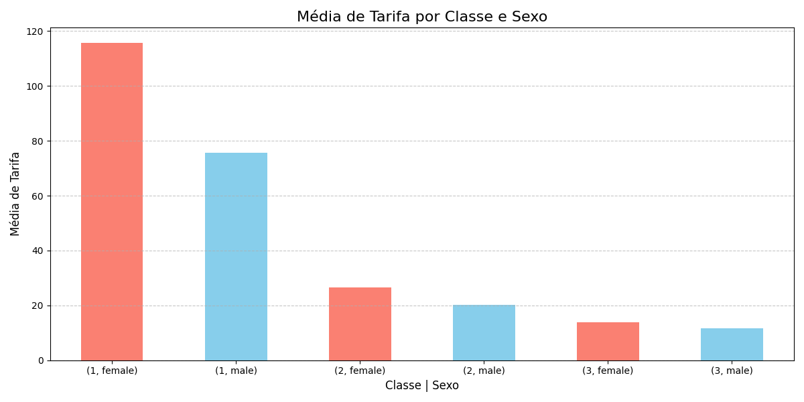
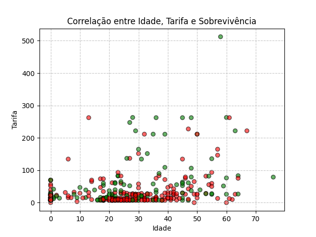
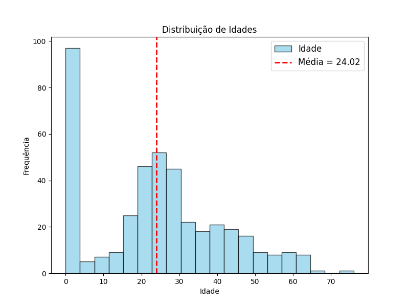
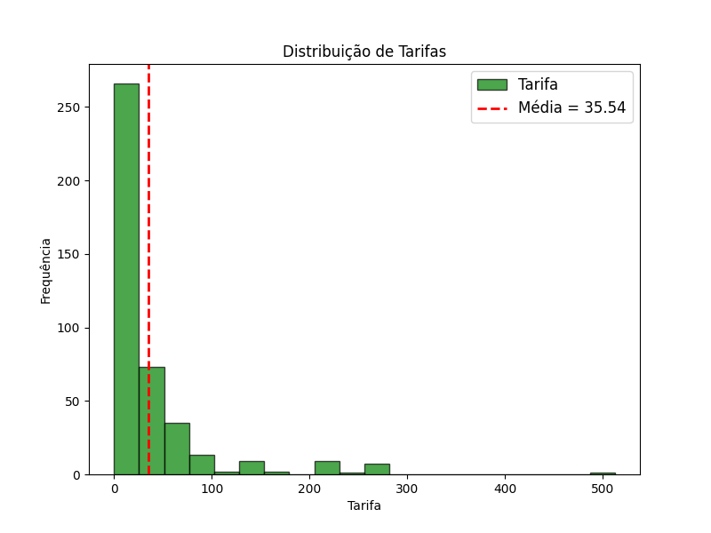
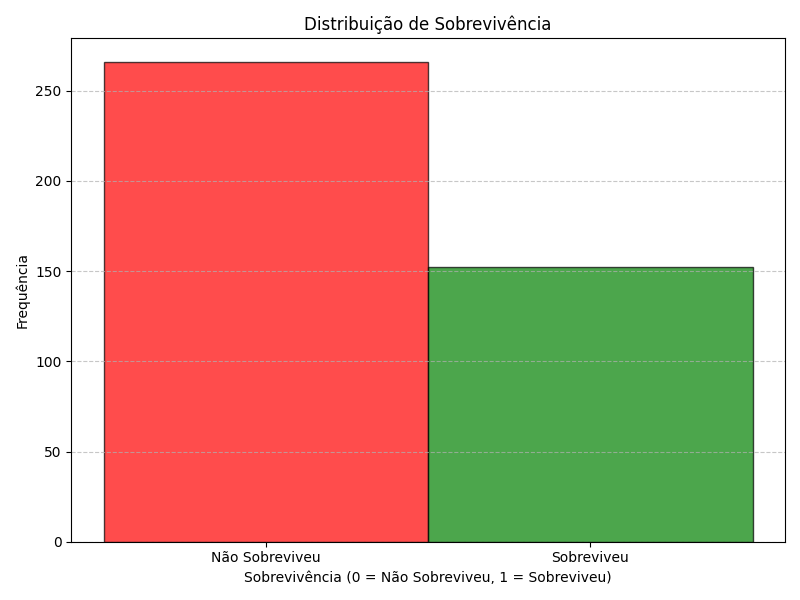
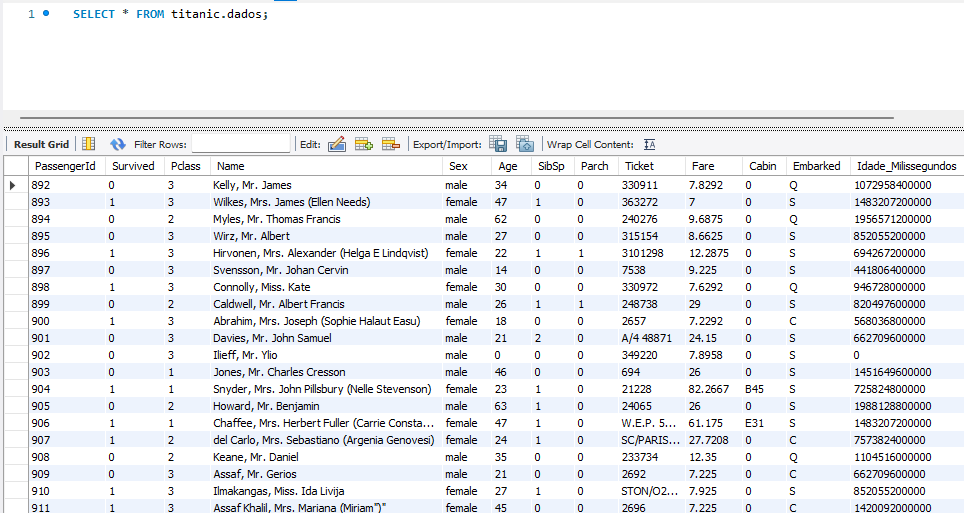
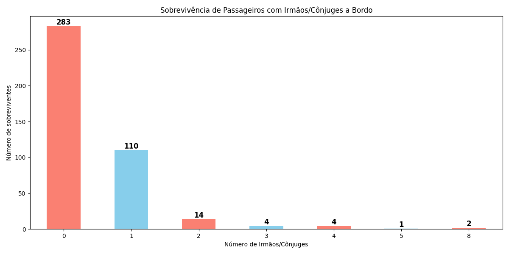
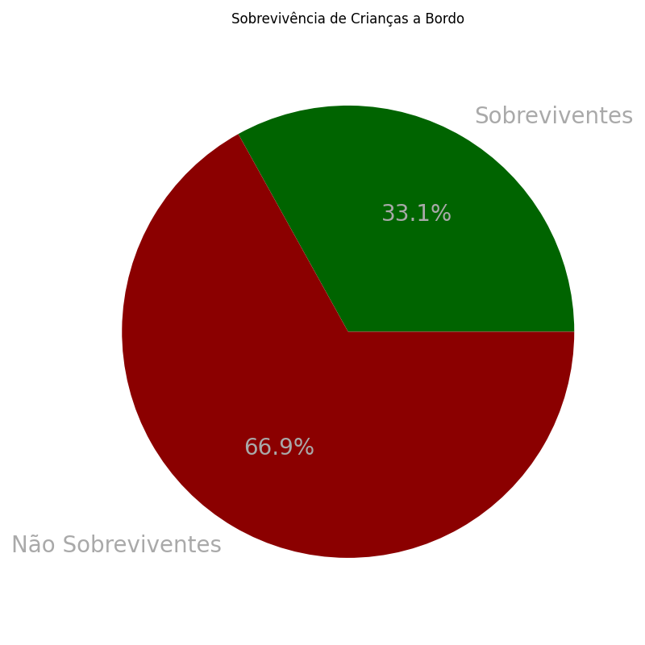

# Análise de Dados do Titanic

**Versão:** v1.0  
**Autores:** Beatriz Guerra, Pedro Pires e Tayara Cruz  
**Formador:** Nelson Santos   
**Data:** Dezembro, 2024  
**UFCD:** 5417 - Programação para a WEB - servidor (server-side)   
**Instituição:** ATEC  

---

## Objetivos do Projeto

Este projeto foi solicitado pelo professor como uma forma prática de aplicar os conhecimentos adquiridos na unidade formativa UFCD5417. O objetivo principal é compreender o ciclo de análise de dados, desde a exploração e limpeza até a geração de insights, utilizando um dos conjuntos de dados do Titanic, que inclui informações sobre os passageiros..

---

## Funcionalidades do Projeto

### 1. **Leitura e Exploração dos Dados**:
#### Objetivos
   - Importar e entender a estrutura dos dados brutos relacionados aos passageiros do Titanic.
   - Identificar os atributos mais relevantes para análise (ex.: idade, classe, sobrevivência, etc.).
#### Implementação
   - Foi efetuada a leitura do ficheiro fornecido (titanic.csv) através da função `read()` da biblioteca `pandas`.
   - Utilizou-se as funções `head()` e `tail()` para visualizar, respetivamente, as 5 primeiras linhas e as 5 últimas linhas do DataFrame.
   - A função `info()` da classe `DataFrame` da biblioteca `pandas` permitiu visualizar as informações gerais sobre o DataFrame, como os tipos de dados.
   - Para retorno de uma análise estatística inicial, foi utilizada a função `describe()`.

### 2. **Limpeza e Pré-processamento**:
#### Objetivos
   - Tratar valores ausentes, normalizar informações e garantir a consistência dos dados.
#### Implementação
   - Para verificar os valores nulos e retornar os mesmos em cada coluna, foram utilizadas as funções `isnull().sum()`.
   - De forma a preencher esses valores valores, foi utilizada a função `fillna(0)`, que substituiu todos os valores nulos pelo valor passado como parâmetro.
   - Na coluna `Age` foi utilizado a função `astype(int)` para converter os valores de `float` para `int`.
   - Foi criada uma nova coluna denominada `Idade_Milissegundos` que, através de uma função `lambda`, converte a coluna `Age` para milissegundos.

### 3. **Análise e Manipulação de Dados**:
#### Objetivos
   - Obter estatísticas descritivas (média, mediana, etc.).
   - Filtrar e agrupar dados com base em critérios específicos (ex.: taxa de sobrevivência por classe).
#### Implementação
   - Neste capítulo, foi utilizada a função `groupby()` para diversas operações, uma vez que esta agrupa os dados de acordo com as colunas indicadas.
   - Foi utilizada a função `mean()` para cálculo da média, por exemplo média de sobrevivência dos passageiros por `Pclass`, `Sex` e `Fare`.
   - Foi utilizada a função `value_counts()` para retornar a frequência de um valor numa coluna, juntamente com a função `unstack()`, que reorganiza os dados, e, no exemplo apresentado, dividiu as colunas entre sobreviventes e não sobreviventes.
   - Para arrendondar os resultados para duas casas decimais, foi utilizada a função `round(2)`.
   - Para efetuar contagens nas colunas foi utilizada a função `count()`.
#### Resultados Obtidos
   - Taxa de sobrevivência por classe e sexo - de acordo com os dados obtidos, 100% das mulheres sobreviveram, 0% dos homens sobreviveram.
   - Relação entre idade e sobrevivência - foi obtida uma contagem de sobreviventes e não sobreviventes em cada idade.
   - Tarifa média por classe e sexo - de acordo com os dados obtidos, os passageiros do sexo feminino pagaram uma tarifa superior em todas as classes.
   - Relação entre tarifa e sobrevivência - retorna os dados agrupados por tarifa paga e o respetivo número de sobreviventes.

### 4. **Visualização de Dados**:
#### Objetivos
   - Gerar gráficos e tabelas para melhor compreensão e apresentação dos resultados.
   - Utilizar bibliotecas como Matplotlib para criar visualizações impactantes.
#### Implementação
###### Média de Tarifa por Classe e Sexo

###### Correlação entre Idade, Tarifa e Sobrevivência

###### Distribuição de Frequências de Idade, Tarifa e Sobrevivência

### 5. **Exportação dos Resultados**:
#### Objetivos
   - Salvar os resultados da análise em formatos como CSV ou Excel.
#### Implementação
   - Todos os novos dados gerados foram guardados num ficheiro Excel denominado `relatorio_titanic.xlsx`, através da função `to_excel()` da biblioteca `pandas`.

### 6. **Armazenamento em Base de Dados**:
#### Objetivos
   - Integrar os dados tratados em um banco de dados para facilitar consultas futuras.
#### Implementação
   - Tendo como base o ficheiro Excel `relatorio_titanic.xlsx`, todos os dados foram passados para a base de dados MySQL, com recurso ao software MySQL Workbench.
   - Para criação da tabela e inserção dos dados, foi utilizada a biblioteca `mysql.connector`, e configurada a conexão através da função `connect()`, onde inserimos dados como o `host`, `user`, `passwd` e `database`.
   - Esses dados, guardados numa variável denominada `conn`, que juntamente com os métodos e funções do pacote `mysql.connector` permitiram o acesso à base de dados.
   - Para executar qualquer comando SQL foi utilizado o método abstrato `execute()`, o método `commit()` para efetuar alterações na base de dados e o método `close()` para fechar a conexão.

### 7. **Análise Adicional**:
#### Objetivos
   - Análise que os alunos acharam relevante para tratamento e visualização dos dados.
#### Implementação
###### Sobrevivência de Passageiros com Irmãos/Cônjuges a Bordo

###### Sobrevivência de Crianças a Bordo

---
## Considerações Finais

Este projeto ofereceu uma abordagem prática aos conceitos abordados até à data, permitindo aos alunos:
- Consolidar a aprendizagem teórica num cenário prático.
- Trabalhar com um conjunto de dados real e amplamente conhecido.
- Aprimorar habilidades de programação e uso de ferramentas como Python e SQL.
- Utilizar bibliotecas como Pandas, Matplotlib e MySQL.Connector.

---

